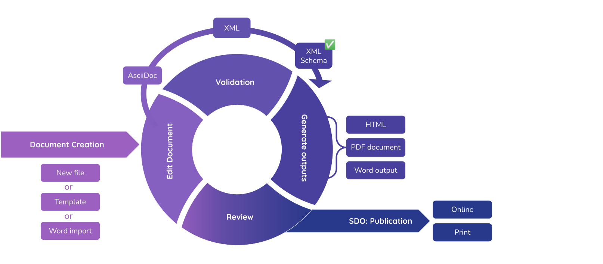

The Metanorma documentation covers all features you need to create your next standard document effortlessly. 

The documentation structure follows the Metanorma workflow, depicted below. 
You'll find background information and best practice articles in the concepts section. If you need to quickly look up an attribute, head to the references section.

.The Metanorma Workflow from start to finish 
