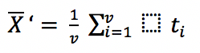

= Asciimath support

Metanorma uses the https://github.com/asciidoctor/asciimath[Asciidoctor Asciimath parser]
to process Asciimath, converting it to MathML for Metanorma processing. For rendering in
HTML, the MathML generated is processed by https://www.mathjax.org[MathJax]. For rendering
in Word, the MathML is converted to https://en.wikipedia.org/wiki/Office_Open_XML[Office Open XML].

== Asciidoctor Asciimath

The version of Asciimath supported by the Asciidoctor Asciimath parser is slightly different 
to other variants of Asciimath. The following are differences between Asciidoctor Asciimath
and the version of Asciimath
documented on http://asciimath.org[asciimath.org]:

=== Miscellaneous symbols:

Asciidoctor Asciimath adds the following as distinct symbols:

dx:: dx identifier

dy:: dy identifier

dz :: dz identifier

dt :: dt identifier

... :: ... operator

"\\ " :: non-breaking space

qquad :: four non-breaking spaces (just as `quad` is processed as two non-breaking spaces)

lim :: lim operator 
Lim :: Lim operator 

' : prime operator, &#x2032

:' :: &#x2235;

/_\\ :: &#x25b3;

frown :: &#x2322;

=== Relation symbols

Asciidoctor Asciimath adds the following as distinct symbols:

:=  :: := operator

=== Operation symbols

setminus :: \\
divide :: &#xf7;
:|: :: | as operator

=== Logical symbols

No difference.

=== Grouping brackets
Asciidoctor Asciimath adds the following as distinct brackets:

|: :: | as left bracket
:| :: | as right bracket

=== Arrows

No difference.

=== Accents 

The following operators are currently missing from Asciidoctor Asciimath:

* color(red)(x)
* cancel(x)

Asciidoctor Asciimath adds the following as distinct accents

tilde :: ~
overarc :: &#x23dc;

=== Greek letters

The Asciidoctor Asciimath gem supports several capital letter symbols, which are not named
in asciimath.org:

Alpha:: Alpha

Beta:: Beta

Epsilon::Epsilon

Zeta :: Zeta

Eta :: Eta

Iota::Iota

Kappa::Kappa

Mu::Mu

Nu::Nu

Rho::Rho

Tau::`Tau`

Upsilon::Upsilon

Chi::Chi

===  Standard functions

All the same

=== Font commands

The following are font commands supported by the Asciidoctor Asciimath gem, in addition
to those named in asciimath.org:

ii :: italic font
bii :: bold italic font
bcc :: bold script font
bfr :: bold fraktur font
bsf :: bold sans serif font
sfi :: italic sans serif font
sfbi :: sans serif bold italic font

== Conversion to Word OOXML

AsciiMath and MathJax processors are tolerant of loose syntax in mathematical expressions.
Currently the conversion of MathML to OOXML is not as tolerant: if a mathematical operator
takes a single argument, the OOXML expects to find that argument brackets as a single entity.
If that does not happen, Word displays a dotted square where it would expect the single
argument to appear. To remedy this, you will need to bracket the argument of the operator
in invisible brackets (`{:`, `:}`).

For example, the following Asciimath displays correctly in HTML under MathJax:

[source,asciidoc]
--
[stem]
++++
bar X' = (1)/(v) sum_(i = 1)^v t_i
++++
--

However, it displays incorrectly in Word:

That is because the `sum` operator expects to find a single expression as its argument,
but `t_i` is processed as two tokens. To get this expression processed correctly for
Word, you will need to bracket `t_i`:

[source,asciidoc]
--
[stem]
++++
bar X' = (1)/(v) sum_(i = 1)^v {:t_i:}
++++
--

