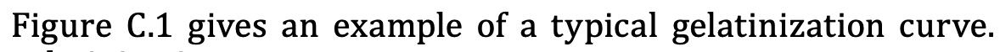

//This file contains all the lessons for the tutorials. Since there was no template while I (Tina) contributed to Metanorma, you'll find all lessons here, and you can copy the inlcudes into the tutorial templates later. 
//All content that isn't fit for reuse elsewhere can be written into the file directly. 
//Should you have any questions, you can contact me via e-mail (tina@kickoke.com). 

//Lesson 1
== Introduction to Metanorma

include::../tutorials/learning_objectives.adoc[tag=learningobjectives-1]
>> Start next lesson 

//Lesson 1-1
== What is Metanorma?
=== What you get is what you see vs. What you get is what you mean
include::../author/concepts/wysiwyg_vs_wysiwym.adoc[tag=tutorial]
=== What is Metanorma?
include::../author/concepts/what_is_metanorma.adoc[tag=tutorial]

Let’s explore the workflow of Metanorma in the next lesson.
>> Start next lesson 

//Lesson 1-2
== The Metanorma Workflow

include::../author/concepts/metanorma_workflow.adoc[tag=tutorial, leveloffset=+1]

Before we dive into AsciiDoc, let's recap what we've learnt so far.
>> Start next lesson 

//Lesson 1-3
=== Summary

Let’s recap what we’ve learned so far:

* Metanorma uses a what you see is what you mean (WYSIWYM) approach, meaning that the text you write is what you *want* to see.
* You need to render documents to have a correct visible output. The appearance is controlled in a stylesheet.
* Metanorma is an umbrella term for several things and consists of: +
The metanorma toolchain, document models and a XML schema of these document models.
* Metanorma documents use Metanorma AsciiDoc markup 
* When you want to generate an output, the AsciiDoc document is converted into XML in order to be checked against the XML schema.
* If the document is valid, Metanorma generates an HTML, PDF and Microsoft Word (`.doc`) output. 

Now that we have covered the fundamentals, let’s have a look at AsciiDoc.
>> Start next lesson

//Lesson 2 
== Introduction to AsciiDoc

include::../tutorials/learning_objectives.adoc[tag=learningobjectives-2]

include::../author/concepts/intro_to_asciidoc.adoc[tag=tutorial, leveloffset=+2]

We will have a look at these different levels of markup in the following lessons. 
You can do the exercises either in the browser, or on your local machine. If you choose to use your local machine, you will need to install metanorma and set up a new metanorma project. 

>> Start next lesson

//Lesson 2-1
== The Header
inlcude::../author/topics/metadata.adoc[tag=tutorial]

[[exercise-2-1]]
include::exercises.adoc[tag=exercise-2-1]

Let’s add some sections to our document in the next lesson.
>> Start next lesson 

//Lesson 2-2
== Sections

inlcude::../author/topics/sections.adoc[tag=tutorial]

[[exercise-2-2]]
include::exercises.adoc[tag=exercise-2-2]

We’ve built the basic structure of a Metanorma document. Let’s add some content to our document in the next lesson.
>> Start next lesson 

//Lesson 2-3
== Blocks
include::../author/topics/blocks.adoc[tag=tutorial]

Let’s look at lists in the next lesson. 
>> Next lesson

//Lesson 2-3-1
=== Lists

include::../author/topics/blocks/lists.adoc[tags=tutorial,leveloffset=+2]

[[exercise-2-3]]
include::exercises.adoc[tag=exercise-2-3]

Great work! Let’s have a look at term definitions in the next lesson.
>> Start next lesson

//Lesson 2-3-2
=== Term definitions
If you want to cite a term throughout the standard, include it in the terms and definitions section. Term definitions vary from definition lists, as they are more granular and provide metadata to mark features such as alternative terms or deprecated terms. 
Let’s have a look at a term entry:

[source, AsciiDoc]
----
== Terms and definitions <1>

=== husked rice <2>
deprecated:[cargo rice] <3>

Paddy from which the husk only has been removed. <4>

[.source] <5>
<<ISO7301,clause 3.2>>, The term "cargo rice" is shown as deprecated, and Note 1 to entry is not included here

=== milled rice
alt:[white rice] <6>

term:[husked rice] from which almost all of the bran and embryo have been removed by milling. <7>

=== extraneous matter
alt:[EM]
domain:[rice] <8>

organic and inorganic components other than whole or broken kernels

[example] <9>
Foreign seeds, husks, bran, sand, dust.
----
<1> The start of the terms and definitions section
<2> The term that should be defined is marked as a subheading using three equal signs. `===`.
<3> The term `husked rice` supersedes `cargo rice`. To document the old term, use the annotation `deprecated:[term]`.
<4> Definition for the term: the first paragraph of text after macros like `deprecated:[]` and `alt:[]`.
<5> The `[.source]` attribute indicates that a citation follows, indicating where the term definition has been taken from. Make sure to include the dot `.` before source, so that the citation will be rendered correctly. 
<6> `alt:[white rice]` indicates the alternative term for milled rice. 
<7> `term:[husked rice]` cites the previously introduced term.
<8> Terms that do not obviously belong to a certain domain can be annotated with `domain:[]` at the start of their definition.
<9> If you provide an example, use the `[example]` attribute so that it renders according to the styling rules of your SDO. 

[[exercise-2-4]]
include::exercises.adoc[tag=exercise-2-4]

The next type of block we will cover are tables.
>> Start next lesson

//Lesson 2-3-3
=== Tables
include::../author/topics/blocks/tables.adoc[tag=tutorial]

[[exercise-2-5]]
include::exercises.adoc[tag=exercise-2-5]

Let’s look at inserting images next.
>> Start next lesson

//Lesson 2-3-4
=== Images
include::../author/topics/blocks/images.adoc[tag=tutorial]

[[exercise-2-6]]
include::exercises.adoc[tag=exercise-2-6]

Let’s look at admonitions next.
>> Start next lesson

//Lesson 2-3-5
=== Admonitions
include::../author/topics/blocks/admonitions.adoc[tag=tutorial]
[[exercise-2-7]]
include::exercises.adoc[tag=exercise-2-7]

Great progress so far! Let's look at code samples in the next lesson.
>> Start next lesson

//Lesson 2-3-6
=== Code Samples

AsciiDoc supports code samples using the `[source]` attribute before a new block. If you specify the coding language, the sample will be highlighted correctly in HTML output. Unlike other blocks in Asciidoc, line breaks and space indentations are preserved. Have a look at the example:

[source, AsciiDoc]
------
.Sample Code <1>
[source,ruby] <2>
==== <3>
puts "Hello, world." <4>
%w{a b c}.each do |x|
  puts x
end 
==== <5>
------

<1> Title for your code sample (optional)
<2> `[source]` specifies that the block contains code. `ruby` is the coding language. The block will highlight keywords depending on the coding language.
<3> Starting delimiter
<4> Sample code
<5> Ending delimiter

[[exercise-2-8]]
include::exercises.adoc[tag=exercise-2-8]

We’re done with blocks - good job! The next lesson covers inline markup. 
>> Start next lesson

//Lesson 2-4
== Inline Markup

To annotate single words, you use inline markup. The markup encloses the word(s) and you do not need to begin a new line. Inline markup allows you to:

* Emphasize text
* Link to external resources with hyperlinks
* Create internal cross-references
* Create index entries
* Create Bibliographic entries

Let’s look at these features in the following lessons.
>> Start next lesson

//Lesson 2-4-1
=== Text markup

The simplest form of inline markup is to emphasize text. 
AsciiDoc allows you to:

* Make words *bold* using asterisks 
* _Italicise_ words with underscores 
* Apply `monospacing` using backticks

[source, AsciiDoc]
---- 
*bold*
_italic_
`monospace`
^superscript^
~subscript~
----

Metanorma extends these simple formats with:

* Strikethrough text ([strike]#strike through text#)
* Smallcaps text ([smallcap]#small caps text#)
* Underline text ([underline]#underline text#)

[source, AsciiDoc]
---- 
[strike]#strike through text#
[smallcap]#small caps text#
[underline]#underline text#
----

Metanorma also supports automatic character replacements, for example the copyright symbol © can be entered using `(C)`. For more information about automatic character replacements, see https://docs.asciidoctor.org/asciidoc/latest/subs/replacements/[the AsciiDoc documentation]. 

[[exercise-2-9]]
include::exercises.adoc[tag=exercise-2-9]

Let’s look at a more advanced form of inline formatting: index entries
>> Start next lesson

==== Index Terms

NOTE: Metanorma always processes index terms and creates the corresponding XML. However, not all flavors render an Index section. Check out the https://www.metanorma.org/flavors/[flavor documentation] for your SDO to see if it supports indexing.
Before you define an index term, your document needs a section where the index terms can appear. To create an index, define a level 1 section (==) marked with the style index at the end of your document.

[source, AsciiDoc]
----
[index]
== Index
----
Index entries can consist of up to three levels using a comma to separate the terms. Metanorma provides two options to create an index entry:

* Visible index terms are words within the text that are annotated with an index entry using double parentheses. `\((Level 1 index term))`
* Hidden index terms are index entries that are not visible in the final output and are generated using triple parentheses. `(\((Level 1 index term, Level 2 index term, Level 3 index term)))`. These allow the index to include optional subterms and sub-subterms; they also allow the index term to differ from what actually appears in the text.

Let’s have a look at an example:

[source, AsciiDoc]
----
The Lady of the Lake, her arm clad in the purest shimmering samite,
held aloft Excalibur from the bosom of the water,
signifying by divine providence that I, ((Arthur)), <1>
was to carry Excalibur (((Sword, Broadsword, Excalibur))). <2>
----
<1> `\((Arthur))` will be displayed as `Arthur` in the text and carries a first level index entry
<2> `(\((Sword, Broadsword, Excalibur)))` will not appear in the text, but a three level index entry will be generated.

[[exercise-2-10]]
include::exercises.adoc[tag=exercise-2-10]

In the next lesson, we will cover references and links. 
>> Start next lesson

==== References

References are a core part of standards, because they coexist and relate to other standard documents. There are four types of references:

* Hyperlinks to an external source, for example a link to a website
* Metadata references
* Internal references to a section, image, table, etc.
* Bibliographic entries

*Hyperlinks*

AsciiDoc lets you include links to external sources by pasting the URL into the document, and optionally appending the link text in square brackets `[Link text]`. 

.Example of a link
[source, AsciiDoc]
----
http://www.iso.org/[International Organization for Standardization].
----

*Metadata references*

Every document contains a set of metadata to describe the document. You can insert a metadata reference by putting the attribute in curly braces `{attribute}`. The reference will be replaced with the value in the rendered output. 

[source, AsciiDoc]
----
:technical-committee-number: 2
:technical-committee: Fasteners
:subcommittee-number: 11
:subcommittee: Fasteners with metric external thread

This document was prepared by Technical Committee ISO/TC {technical-committee-number}, _{technical-committee}_, Subcommittee SC {subcommittee-number}, _{subcommittee}_.
----

*Internal references*

To link to an important place in your document, you need to set an anchor using double square brackets `[[anchor]]`. Metanorma automatically numbers and names these references; because they are autonumbered, they will be renumbered automatically if you insert any new text of the same type. Since the markup will be converted into XML, the anchor must follow the https://www.w3.org/TR/xml-names11/[XML namespace conventions]. Therefore, an anchor name name must not contain: 
colons
whitespaces
words starting with numbers.

[source, AsciiDoc]
----
[[figureC-1]]
.Typical gelatinization curve 
image::images/rice_image2.png[Image of the gelatinization curve] 
----

image::../assets/author/tutorials/references_img_anchor.jpg[]

To reference an anchor, type the anchor name like this `<<anchor>>`.
[source, AsciiDoc]
----
 <<figureC-1>> gives an example of a typical gelatinization curve.
----

If you want to display text other than the anchor text, you just have to append the text inside the brackets using a comma.
 
[source, AsciiDoc]
----
 <<figureC-1, The diagram>> gives an example of a typical gelatinization curve.
----

*Bibliographic entries*

In standard documents typically there are two types of references, namely the “normative references” and the “bibliography” (informative references).
Every bibliographic section must be preceded by the style attribute `[bibliography]` so that bibliographic references are recognized as such. 

A reference entry is usually part of an unordered list (`*`). The bibliographic entry is enclosed in triple square brackets (`[[[]]]`) and contains:

. The anchor name used to reference this entry
. A document identifier

After the reference, you may include the reference text in italics, for example the title of the document. If the document identifier is recognised by Metanorma, however, its bibliographic description is fetched automatically from the SDO web site, and will overwrite any title you provide with the authoritative title of the reference.

[source, AsciiDoc]
----
* [[[anchor,document identifier or reference tag]]], _reference list text_
----

.Example for a bibliography section
[source, AsciiDoc]
----
[bibliography]
== Normative references

* [[[ISO20483,ISO 20483:2013]]], _Cereals and cereal products -- Determination of moisture content -- Reference method_
* [[[ISO6540,ISO 6540:1980]]]. _Maize -- Determination of moisture content (on milled grains and on whole grains)_
----
Gets rendered as:
* ISO 20483:2013. _Cereals and cereal products — Determination of moisture content — Reference method_
* ISO 6540:1980. _Maize — Determination of moisture content (on milled grains and on whole grains)_

To cite an entry from your bibliography you type the anchor name like this `<<ISO20483>>`.
If you want to specify a location within the cited document, you can add https://www.metanorma.org/author/topics/document-format/bibliography/#localities[localities] in the brackets like so: `<<ISO20483, part=IV,chapter=3,paragraph=12>>`.

[[exercise-2-11]]
include::exercises.adoc[tag=exercise-2-11]

Let’s summarize what we’ve learnt so far.
>> Start next lesson

=== Summary

We’ve covered a lot of ground, so here is a quick summary for you:

* Each Metanorma document contains metadata in the header using the colon notation `:attribute:`.
* A Metanorma document consists of several predefined sections. The document model of your organization dictates which are optional and which are mandatory. Sections are invoked using equal signs `=`.
* Blocks are entities that belong together, such as paragraphs, lists, tables, etc. Paragraphs and lists do not need to be marked by delimiters. The remaining block types begin and end with a delimiter, for example four dashes `----`.
* Inline markup is used for text formatting and references. You can reference:
** an external source (`URL[Link text]`) 
** Metadata (`{attribute}`)
** Places in the document by setting an anchor (`[[anchor-id]]`) and referencing the anchor (`<<anchor-id>>`)
** Bibliographic entries + 
[source, AsciiDoc]
----
* [[[anchor,document identifier or reference tag]]], _reference list text_
<<anchor>>
----

You did a great job so far! Let’s talk about reviewing documents in the next lesson. 
>> Start next lesson

== Reviewing Metanorma Documents

include::../tutorials/learning_objectives.adoc[tag=learningobjectives-3]

>> Start next lesson

=== Adding Comments

include::../author/topics/document-format/reviewer-notes.adoc[leveloffset=1]

[[exercise-3-1]]
include::exercises.adoc[tag=exercise-3-1]

Now that we've commented on the content, let's create a draft of the document. 
>> Start next lesson

=== Rendering a Draft Document

To render a draft that your peers should review, you need to add these metadata to the document header:

* `:draft:`: Tells the compiler to display comments in the final output
* `:status: draft` Defines the current document stage. +
NOTE: Some flavors, for example ISO, use `:docstage:` and a status code to indicate in what stage the document is.

To compile a metanorma document you must enter the name of the application `metanorma` and the document you want to compile `document.adoc`. 

[source, shell]
----
metanorma document.adoc
----
With this command you trigger the metanorma toolchain to:

* Read the AsciiDoc input
* Convert it into XML
* Check the XML against the document model (XML schema)
* Create HTML, PDF, and DOC output

[[exercise-3-2]]
include::exercises.adoc[tag=exercise-3-2]

Now that you are familiar with the simplest way of creating a Metanorma document, let's look at different ways to compile documents in the next lesson.
>> Start next lesson

== Publishing a Metanorma Document

include::../tutorials/learning_objectives.adoc[tag=learningobjectives-4]

>> Start next lesson

=== Compiling a Metanorma Document

To successfully compile a Metanorma document, the toolchain looks at:

* Metadata: The title, document flavor, and document type.
* Syntax: Is the entered AsciiDoc code correct?
* Dependencies: Are all tools needed to compile the document installed?
* File references: Are any files referred to by the file being compiled, and is their path entered correctly, for example when you include images (`image::PATH[]`). Advanced AsciiDoc usage also allows a document to embed other AsciiDoc documents (`include::PATH[]`), and Metanorma extends this in advanced usage to external data sources. 

To compile a Metanorma document:

. On the command line, go to the folder where the document you want to compile is located. 
. Enter the following command: +
[source, shell]
----
metanorma document.adoc
----
With this command you trigger the metanorma toolchain to:

* Read the AsciiDoc input
* Convert it into XML
* Check the XML against the document model (XML schema)
* Create HTML, PDF, and DOC output

You can also manipulate the way Metanorma compiles a document by setting flags. Flags are appended to the build command, like this:  

.Example of a build command with a flag
[source, shell]
----
metanorma document.adoc -x html
----

You can use the following flags to manipulate the building process:

* `-t`: Sets the flavor of the document +
NOTE: Either define the flavor in the metadata using `mn-document-class` or use `-t flavor`
* `-x`: Sets the output format(s) of the document 
* `-o`: Enter a path that the output should be saved to. 

To see the full list of possible build commands, open the metanorma help on the command line.

[source, shell]
----
metanorma help compile
----

>> Start next lesson

//Troubleshooting lesson
include::../author/topics/troubleshooting.adoc[leveloffset=+2]

//Exercise will promt the user to fix some bugs in a document: For example syntax errors. 
include::exercises.adoc[tag=exercise-4]

Great work!
>> Finish the tutorial
// Maybe include a page after the tutorial where a user can type in their name and a certificate (PDF) will be generated + downloaded? :)
